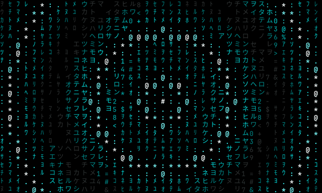
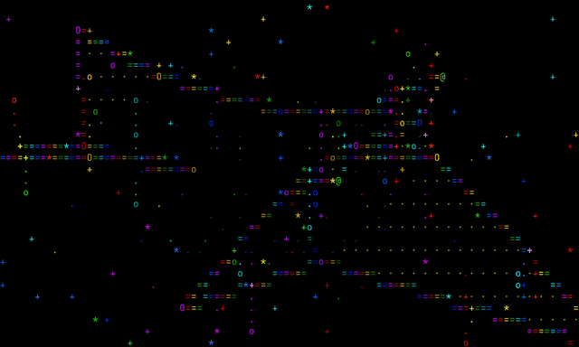
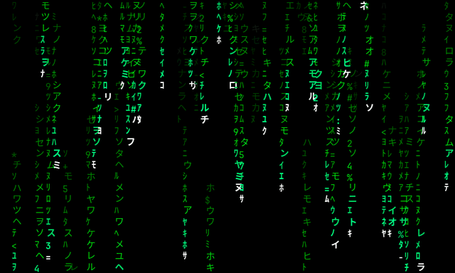
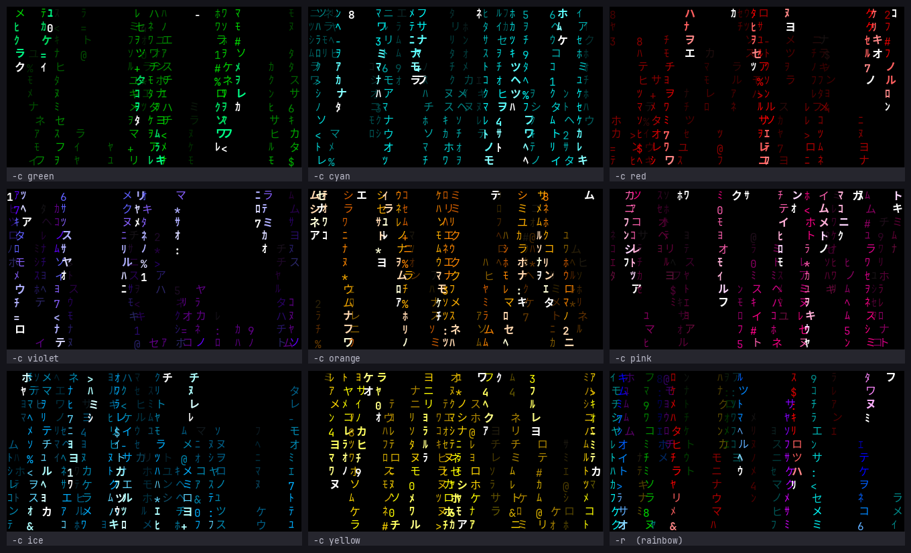
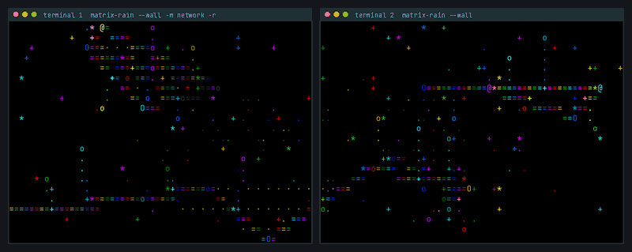
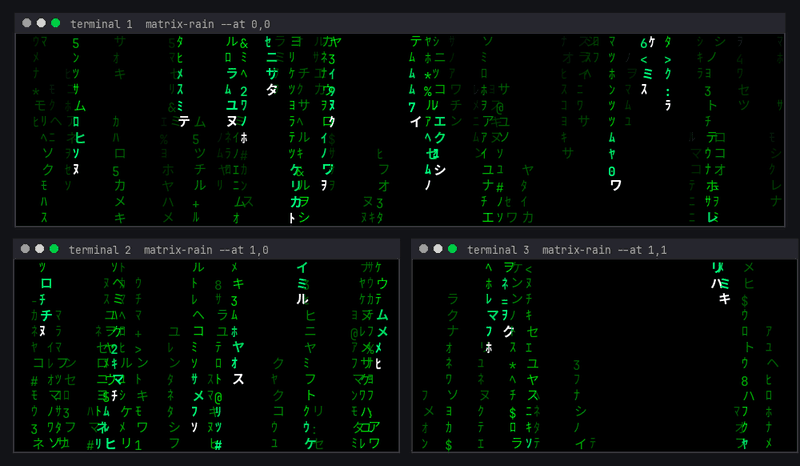
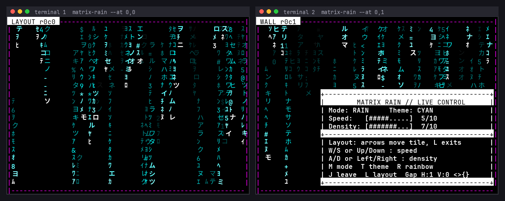
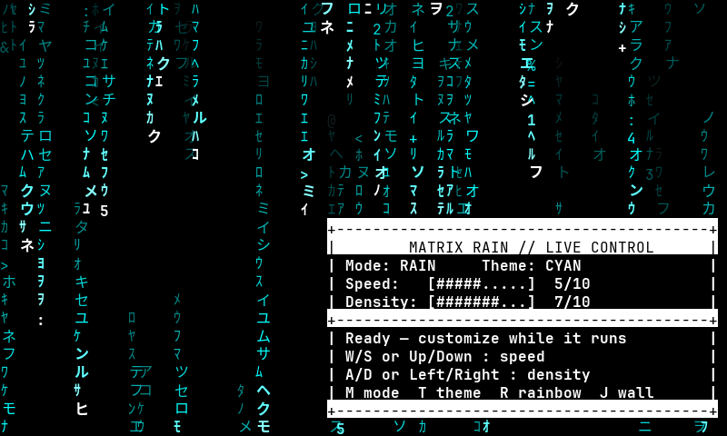

<h1 align="center">Matrix Rain</h1>

<p align="center">
  <b>Cinematic Katakana rain, pulses and networks for your terminal.</b><br>
  Three live visualizers, 24-bit gradients, and a <a href="#video-wall">video wall</a> that turns several terminals into one big screen.
</p>

<p align="center">
  
  
  
</p>

<p align="center">
  
</p>
<p align="center"><sub><code>matrix-rain -m pulse -c violet</code> — rings expanding over plain black</sub></p>

<p align="center">
  <a href="#visualizers">Visualizers</a> ·
  <a href="#themes">Themes</a> ·
  <a href="#video-wall">Video wall</a> ·
  <a href="#controls">Controls</a> ·
  <a href="#installation">Install</a> ·
  <a href="#usage">Usage</a>
</p>

## Quick start

```bash
git clone https://github.com/Serg-Ale/matrix-rain.git
cd matrix-rain
./matrix-rain -m pulse -c violet      # the animation above
```

Press `m` to cycle visualizers, `t` for themes, `r` for rainbow, `q` to quit.
Needs Python 3 and a UTF-8 terminal; there is nothing to `pip install`.
More ways to install are [below](#installation).

## Visualizers

<table>
  <tr>
    <td align="center" width="50%">
      <br>
      <b>Network</b><br>
      <sub>A slowly turning 3D point cloud with links, branches, packets and complementary filled faces.<br><code>matrix-rain -m network -r</code></sub>
    </td>
    <td align="center" width="50%">
      <br>
      <b>Rain</b><br>
      <sub>The classic: falling Katakana with a glowing white head and an 8-shade trail.<br><code>matrix-rain</code></sub>
    </td>
  </tr>
</table>

**Pulse** (the animation at the top) sends rings of characters out from the
centre of the screen, with a white core and a fading halo. Press `m` to cycle
Rain → Pulse → Network, or start in one with `-m`:

| Mode | Visual |
|------|--------|
| `RAIN` | The classic falling Katakana rain |
| `PULSE` | Expanding ASCII energy rings from the screen centre |
| `NETWORK` | A 3D point cloud with branches, packets, and complementary filled faces |

Your selected color theme, rainbow mode, speed, and density apply to every
visualizer. Density changes the number of rain streams, pulse rings, or network
nodes depending on the active mode. `,` / `.` adjust the Pulse ring thickness in
Pulse and the tempo in Network (intentionally slow: global speed `10` matches
the previous Network pace at global speed `2`, with a Network-only multiplier
from `0.1x` through `1.0x`, in `0.1x` steps).

## Themes

Eleven color themes, plus a rainbow mode that cycles through all of them
column by column:

<p align="center">
  
</p>

| Color | Description |
|-------|-------------|
| `green` | Classic Matrix green (default) |
| `red` | Red theme |
| `blue` | Blue theme |
| `cyan` | Cyan/teal theme |
| `magenta` | Purple/magenta theme |
| `yellow` | Yellow/gold theme |
| `white` | Grayscale theme |
| `orange` | Warm amber theme |
| `pink` | Neon pink theme |
| `ice` | Icy blue theme |
| `violet` | Deep violet theme |

Rainbow mode is its own flag (`-r`/`--rainbow`), not a `--color` value.

## Video wall

<p align="center">
  
</p>
<p align="center"><sub>Two terminals, one Network scene. Each window shows its half of the same canvas.</sub></p>

Run `matrix-rain --wall` in two or more terminals on the same machine and they
become **tiles of one big screen**: the animation runs once, across all of them.
The first terminal becomes the host; the others join it, side by side in the
order they open. Theme, mode, rainbow, speed and density are shared — change
them in any tile and every tile follows.

```bash
matrix-rain --wall -c cyan    # first terminal: starts the wall
matrix-rain --wall            # second, third...: join it
```

### Grids with `--at`

If your terminals aren't in a single row, say where each one sits with
`--at ROW,COL` (row 0 is the top, column 0 the left). For one terminal on top
and two below:

```bash
matrix-rain --at 0,0 -c cyan    # top (starts the wall)
matrix-rain --at 1,0            # bottom left
matrix-rain --at 1,1            # bottom right
```

<p align="center">
  
</p>
<p align="center"><sub>A 2D grid: the rain streams pass from the top window into the two below it.</sub></p>

<details>
<summary><b>Fine-tuning the wall</b>: layout mode, seam gap, joining and leaving, host succession</summary>

<br>

Rows stack top to bottom and tiles in a row go left to right by column. Tiles
of different sizes line up along the top of their row, and a row as wide as
its widest tile — keep the rows about the same total width, since any
difference is simply blank. While the control panel is visible (`p` toggles
it), each tile shows its own `WALL rXcY` badge in the corner. Terminals that
don't pass `--at` queue up in row 0 in the order they join.

**Layout mode.** Reorganizing doesn't need a restart: press `L` in a tile to
enter layout mode, and its arrow keys move that tile around the grid (moving
onto another tile swaps the two); press `L` again to leave the mode. While it's
on, every tile gets seam guides and the badge shows `LAYOUT rXcY`. Outside
layout mode the arrows adjust speed and density as usual. If a terminal joins
with an `--at` already taken, it gets that spot and the tile that was there
steps aside to the next free column of its row.

<p align="center">
  
</p>

**Seam gap.** Real windows have frames, and the picture breaks at the seam. In
the wall, the gap keys hide a few columns or rows of the canvas at each seam,
so the image reads as continuous behind the frame: `>` / `<` widen / narrow the
horizontal gap (in columns), `}` / `{` the vertical one (in rows). It starts at
0 and the right value depends on your terminal and font, so adjust it by eye
while watching a seam. The panel shows the current values, and the setting
lasts for the session only.

**Joining and leaving.** You don't have to start in the wall: press `J` in any
running terminal to join (or start) it, and `J` again to leave. Joining adopts
the wall's theme, mode, speed and density; leaving keeps whatever the wall had
at that moment, with the animation starting over.

**Host succession.** Closing the first terminal doesn't end the wall: when the
host goes away (`q`, `Ctrl+C`, a crash, or leaving with `J`), the oldest
remaining tile takes over as host with the wall's last settings (theme, mode,
speed, density and gap) and the others reconnect to it. The animation starts
over, but the picture carries on. Tile positions you moved with layout mode
aren't carried over — tiles go back to the `--at` they declared.

`q` or `Esc` quits that terminal, whether it's the host or not. `--wall` can't
be combined with `-S`. The wall is local to your user on this machine (a
private Unix socket); it doesn't connect across machines.

</details>

## Controls

<p align="center">
  
</p>

| Key | Action |
|-----|--------|
| `q` | Quit |
| `Escape` | Quit |
| `Ctrl+C` | Quit |
| Any key | Quit (in screensaver mode only) |

### Live Customization

Outside screensaver mode, adjust the animation without restarting it:

| Key | Action |
|-----|--------|
| `W` / `↑` / `+` | Increase speed |
| `S` / `↓` / `-` | Decrease speed |
| `D` / `→` / `]` | Increase density (more streams) |
| `A` / `←` / `[` | Decrease density (fewer streams) |
| `t` | Cycle through color themes |
| `r` | Toggle rainbow mode |
| `j` | Join / leave the video wall |
| `l` | Layout mode (in the wall): arrows move this tile |
| `<` `>` / `{` `}` | Wall seam gap: narrower / wider, horizontal / vertical |
| `m` | Cycle visualizers: Rain, Pulse, Network |
| `,` / `.` | Decrease/increase Network tempo (Network mode) or Pulse ring thickness (Pulse mode) |
| `p` | Hide/show the live-control panel |
| `h` / `?` | Show the control panel |

The persistent, btop-inspired panel shows the selected theme plus speed and
density meters. It is hidden automatically in screensaver mode and on terminals
that are too small to render it safely.

<details>
<summary><b>Everything it does</b></summary>

<br>

- **Authentic Japanese characters** — half-width and full-width Katakana (ｦｱｲｳｴｵ / アイウエオ)
- **8-shade color gradients** — bright white head → vibrant color → fade to dark, with a glowing head
- **True color** — 24-bit gradients where the terminal supports it, with an automatic 256-color fallback
- **11 color themes** and a **rainbow mode**
- **3 visualizers** — Rain, Pulse and Network, switchable live with `m`
- **Video wall** — several terminals on one machine act as tiles of a single screen
- **Adjustable speed and density**, live, from 1 to 10
- **Screensaver mode** — exit on any keypress
- **Full terminal coverage** and **smooth, flicker-free animation** (column-based rendering)
- **Terminal resize support** — adapts dynamically to window size changes

</details>

## Installation

### Quick Install

```bash
# Clone the repository
git clone https://github.com/Serg-Ale/matrix-rain.git

# Make it executable
chmod +x matrix-rain/matrix-rain

# Option 1: Run directly
./matrix-rain/matrix-rain

# Option 2: Add to your PATH (recommended)
mkdir -p ~/bin
ln -sf "$(pwd)/matrix-rain/matrix-rain" ~/bin/matrix-rain
```

### Add to PATH

**Fish shell** (`~/.config/fish/config.fish`):
```fish
if test -d ~/bin
    if not contains -- ~/bin $PATH
        set -p PATH ~/bin
    end
end
```

**Bash/Zsh** (`~/.bashrc` or `~/.zshrc`):
```bash
export PATH="$HOME/bin:$PATH"
```

## Usage

```bash
# Classic green Matrix rain (default)
matrix-rain

# Different colors
matrix-rain -c red
matrix-rain -c cyan
matrix-rain -c blue
matrix-rain -c magenta
matrix-rain -c yellow
matrix-rain -c white

# Rainbow mode!
matrix-rain --rainbow

# Start straight in a different visualizer (default: rain)
matrix-rain -m pulse
matrix-rain -m network

# Adjust speed (1-10, default: 5)
matrix-rain -s 8      # Faster
matrix-rain -s 2      # Slower, more dramatic

# Adjust density (1-10, default: 7)
matrix-rain -d 10     # Maximum density
matrix-rain -d 3      # Sparse rain

# Screensaver mode (exit on any keypress)
matrix-rain -S

# Combine options for custom experience
matrix-rain -c green -s 6 -d 9      # Fast, very dense green
matrix-rain -c cyan -s 3 -d 5 -S    # Slow cyan screensaver
matrix-rain -m network --rainbow -s 7 -d 8  # Fast dense rainbow network
```

## Command Line Options

| Flag | Long Form | Description | Default |
|------|-----------|-------------|---------|
| `-c` | `--color` | Rain color theme | `green` |
| `-m` | `--mode` | Starting visualizer (`rain`, `pulse`, `network`) | `rain` |
| `-s` | `--speed` | Animation speed (1-10) | `5` |
| `-d` | `--density` | Rain density (1-10) | `7` |
| `-S` | `--screensaver` | Exit on any keypress | `off` |
| `-r` | `--rainbow` | Rainbow color cycling mode | `off` |
| | `--at` | `ROW,COL` — where this terminal sits on the wall's grid; implies `--wall` | queue by arrival |
| | `--wall` | Join (or start) a video wall with other terminals — see [Video wall](#video-wall) | `off` |
| `-h` | `--help` | Show help message | - |

Rainbow mode is its own flag (`-r`/`--rainbow`), not a `--color` value — it
cycles through every theme below rather than picking one.

## Requirements

- **Python 3.6+** (uses `curses`, `dataclasses`)
- **True color or 256-color terminal** (true color is detected from `COLORTERM`; everything falls back to the 256-color palette otherwise)
- **UTF-8 support** for Japanese characters
- **Monospace font with Japanese support** (e.g., Noto Sans Mono CJK, Hack Nerd Font, JetBrains Mono)

### Tested Terminals

- Konsole (KDE)
- GNOME Terminal
- Alacritty
- Kitty
- xterm (with UTF-8)
- Windows Terminal (WSL)

## How It Works

### Character Sets

The animation uses authentic Matrix-style characters:

```
Half-width Katakana: ｦｱｲｳｴｵｶｷｸｹｺｻｼｽｾｿﾀﾁﾂﾃﾄﾅﾆﾇﾈﾉﾊﾋﾌﾍﾎﾏﾐﾑﾒﾓﾔﾕﾖﾗﾘﾙﾚﾛﾜﾝ
Full-width Katakana: アイウエオカキクケコサシスセソタチツテトナニヌネノハヒフヘホ...
Numbers & Symbols:   0123456789:<>*+=-@#$%&
```

### Color Gradient System

Each trail uses an 8-shade gradient for smooth, cinematic fading:

```
Shade 0: ████ Bright White    (head)
Shade 1: ████ Bright Glow     (glow zone)
Shade 2: ████ Medium Glow     (glow zone)
Shade 3: ████ Bright Color    (trail start)
Shade 4: ████ Medium-Bright   
Shade 5: ████ Medium          
Shade 6: ████ Dim             
Shade 7: ████ Very Dark       (trail end)
```

### Architecture

- **Column-based rendering** - Each column independently tracks its rain drop
- **Persistent character grid** - Characters stay in place (no horizontal flickering)
- **Brightness grid** - Separate tracking of fade levels for smooth gradients
- **Continuous color engine** - Gradients are interpolated in RGB and written as raw ANSI, in 24-bit when the terminal supports it and snapped to the nearest xterm-256 index when it doesn't

## Troubleshooting

### Japanese characters not displaying

Make sure your terminal font supports Japanese characters. Recommended fonts:
- Noto Sans Mono CJK
- Hack Nerd Font
- Source Han Code JP
- JetBrains Mono (with fallback)

### Colors look wrong

Ensure your terminal supports 256 colors:
```bash
echo $TERM          # Should show xterm-256color or similar
tput colors         # Should show 256
```

### Characters not reaching bottom of screen

Update to the latest version - this was fixed in commit `34d795b`.

## License

MIT License - Feel free to use, modify, and distribute!

## Contributing

Contributions are welcome! Feel free to:
- Report bugs
- Suggest new features
- Submit pull requests

## Credits

Created by [Serg-Ale](https://github.com/Serg-Ale) with assistance from Claude AI

---

<p align="center">
  <i>"Unfortunately, no one can be told what the Matrix is. You have to see it for yourself."</i>
  <br>
  - Morpheus
</p>
